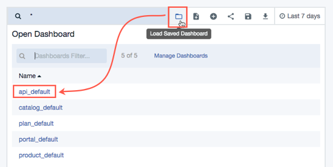
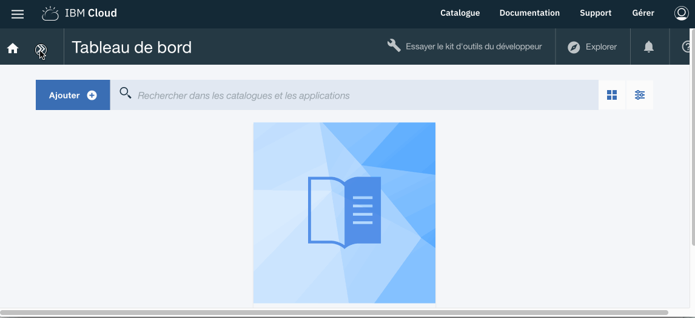
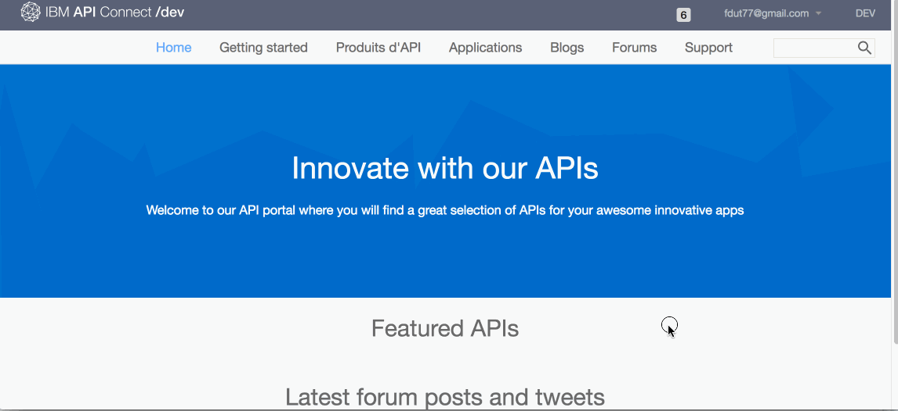

# Technical Workshop : API Connect

## Lab 5 : Analytics 

## Overview 

In this exercise, we will discover Analytics capabilities for both the API Provider and the API Consumer.

You'll better understand how scans are used to view information captured by the Gateway API. You can filter, sort, and aggregate your API event data; Next, present the results in correlated tables, tables, and maps to help you manage service levels, set quotas, set controls, set security policies, manage communities, and analyze trends.

Analytics API is based on the Kibana Open Source Analysis and Visualization Platform, which is designed to work with Elastic Search's real-time distributed search and analysis engine.

## Analytics : API Manager

The API Manager side analytics provides analysis information for the API Provider.

- Click on the icon **>>** -> **Dashboard** > **Sandbox**

- From the **Sandbox** Catalog configuration screen, click on the **Analysis** tab

    

- The default dashboard provides general information such as the five most active products and the five most active APIs. This information is interesting, but we can see other dashboards that provide more data.

- Click the `Load Saved Dashboards` icon to open the list of dashboards. Select the `api-default` dashboard.

    

- Here you will see interesting visualizations showing graphs and graphs containing information about processed API traffic.

- The analytical data can be filtered over different periods and the viewing areas can even be automatically updated. Click the calendar icon that specifies the default period of `Last 7 days`.

    

- Define **Time Range** to `Today`.
	
- Click on `Auto Refresh` and  set the refresh period to ` 5 seconds`.

    

- Return to the client application in the Chrome web browser. Browse the site and test some features to generate additional API calls.

- Go back to the analytic view and note how the data is refreshed automatically.

    

- It is also possible to create your own dashboards.

    

## Analytique : Portail Developpeur

The Developer Portal side analytics provides analysis information for the API Provider.

- Log in to the Developer Portal.

- To know the url of the Developer Portal: Click on the icon **>>** > **(Dashboard)** > **Sandbox** > **Settings** > **Portal** 

    

- Click on Application then on the application **mobileapp** (or another application of your choice) then click on the icon **Analyze**

- The consumer here has in real time its consumption of the APIs with the success rate, data usage, latency.

    

It is of course possible to change the period of time to have information hourly, daily, monthly, annual.

## Summary

During this exercise, we showed the following points:
 
- Analytics for API Provider via the API Manager
- Analytics for API Consumer via the Developer Portal

---
##### 2018 - Frederic Dutheil